# Zendo 2nd Edition Rules Walkthrough

# What

Zendo is a lot like mastermind, except with multiple "students" trying to guess the rule the "master" has chosen.

# Rule cards

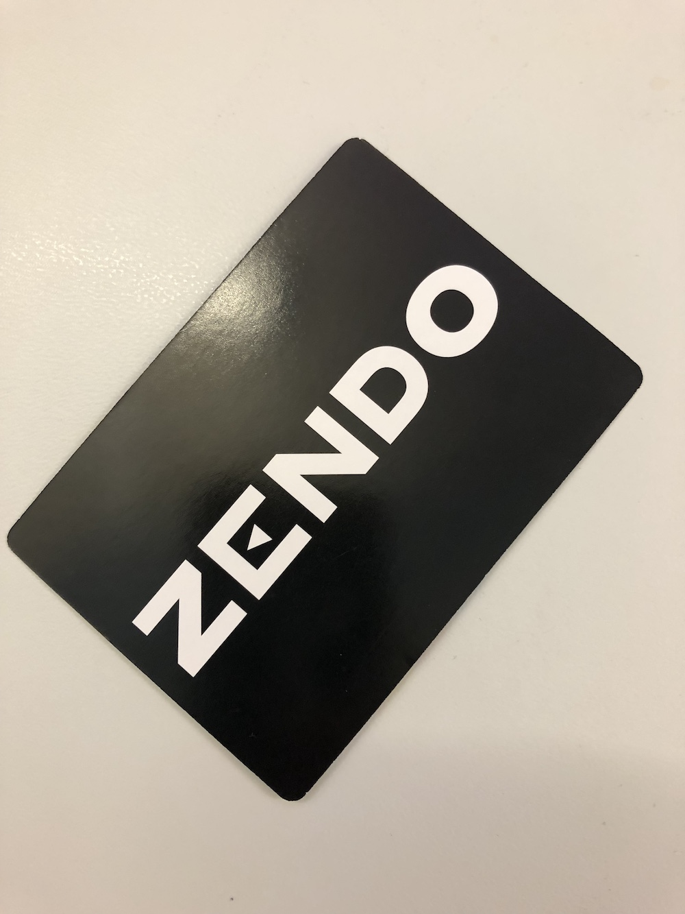

The "master" picks a random Zendo card with a rule guide on it.

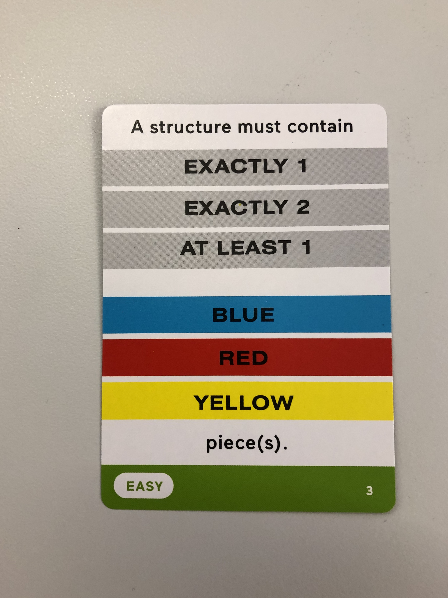

This one is a menu for an "easy" rule. The "master" picks a valid combination. E.g.:

# Structures that meet and fail the rule

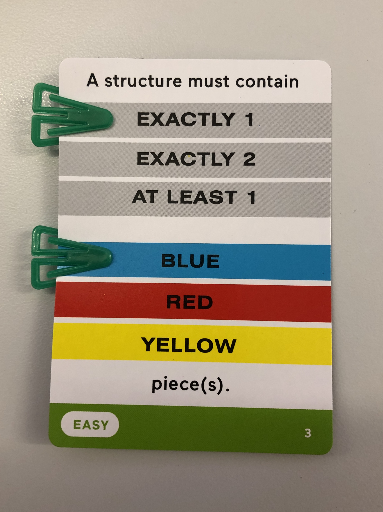

The "master" sets up a structure that meets the rule (indicated by the white marker):

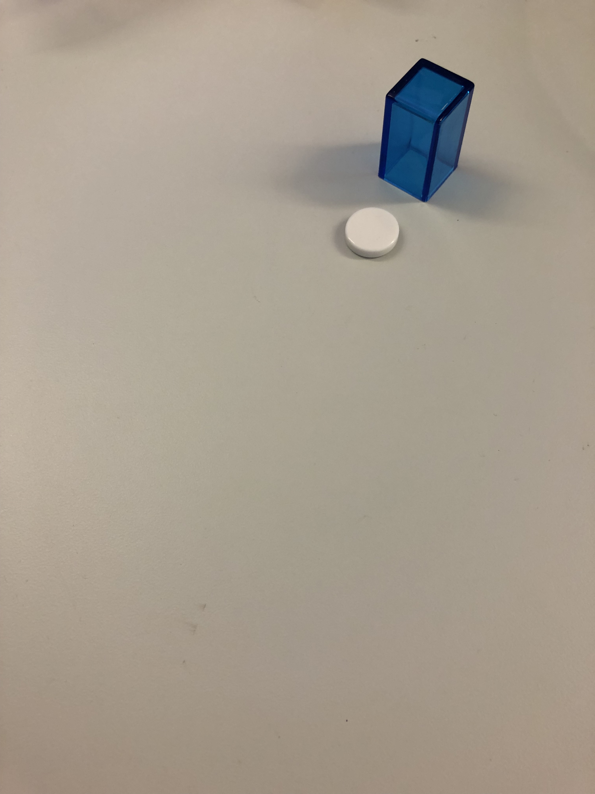

The "master" sets up a structure that fails the rule (indicated by the black marker):

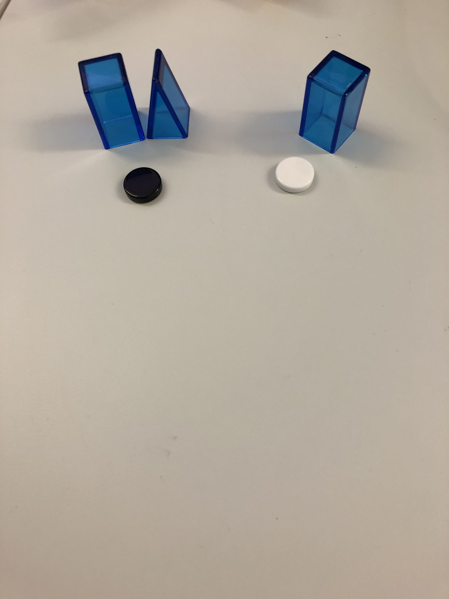

# Turns

"Students":
1. Assemble a structure
2. Tell or Quiz
3. Guess the rule (optional)

# Quiz

The first "student" makes a structure and declares "quiz!":

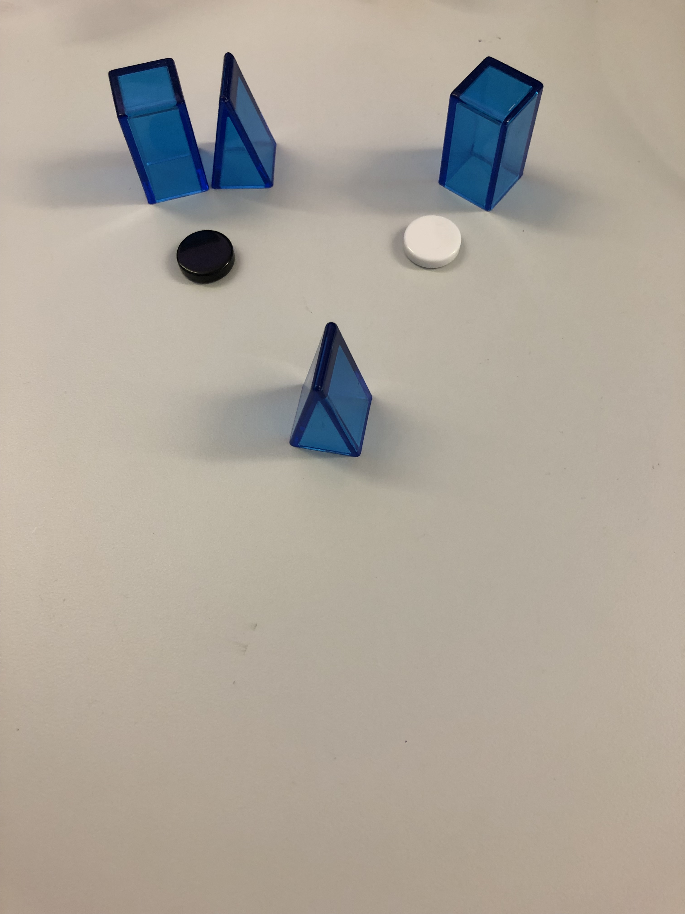

All "students" secretly pick a white marker (meets the rule) or black marker (fails the rule). Once everyone is ready, the master reveals the correct marker, and all "students" that guessed correctly get a green guessing cube (both "students" were correct):

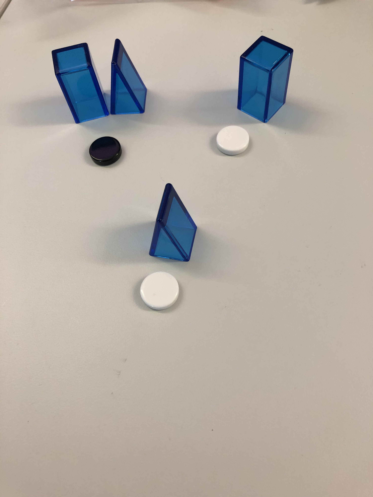

# Guess the rule (optional)

The first "student" decides to then spend their guessing cube, and states their what they think the rule may be "exactly one piece".

Because the first "student" was wrong, the "master" provides a refuting (either positive or negative) structure along with an indicating marker:

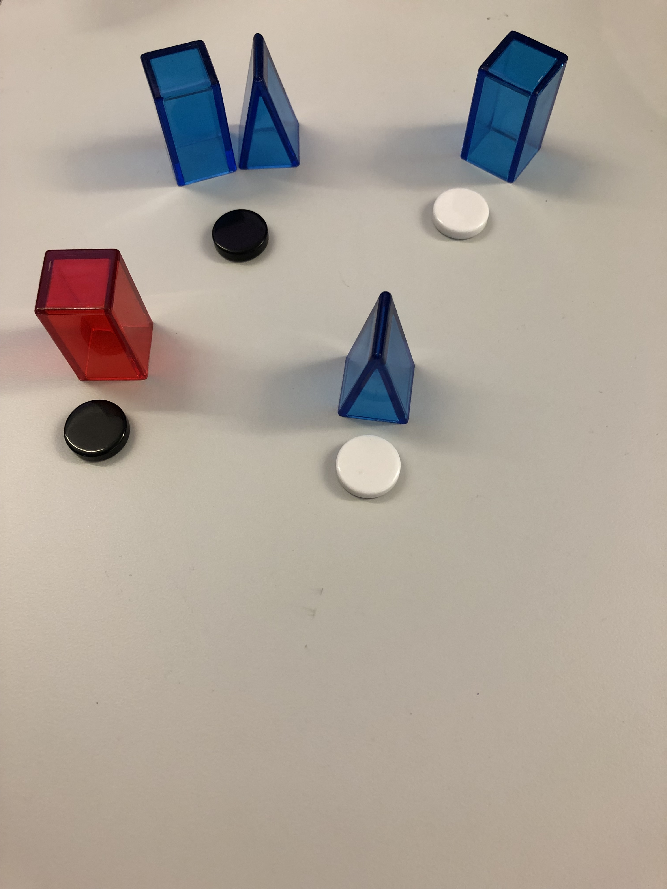

# Tell

The second "student" assembles a structure, and declares "tell!":

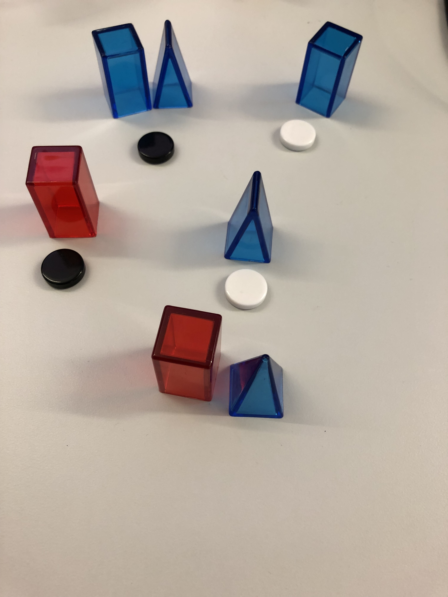

The "master" indicates whether the structure meets (white marker) or fails (black marker) the rule:

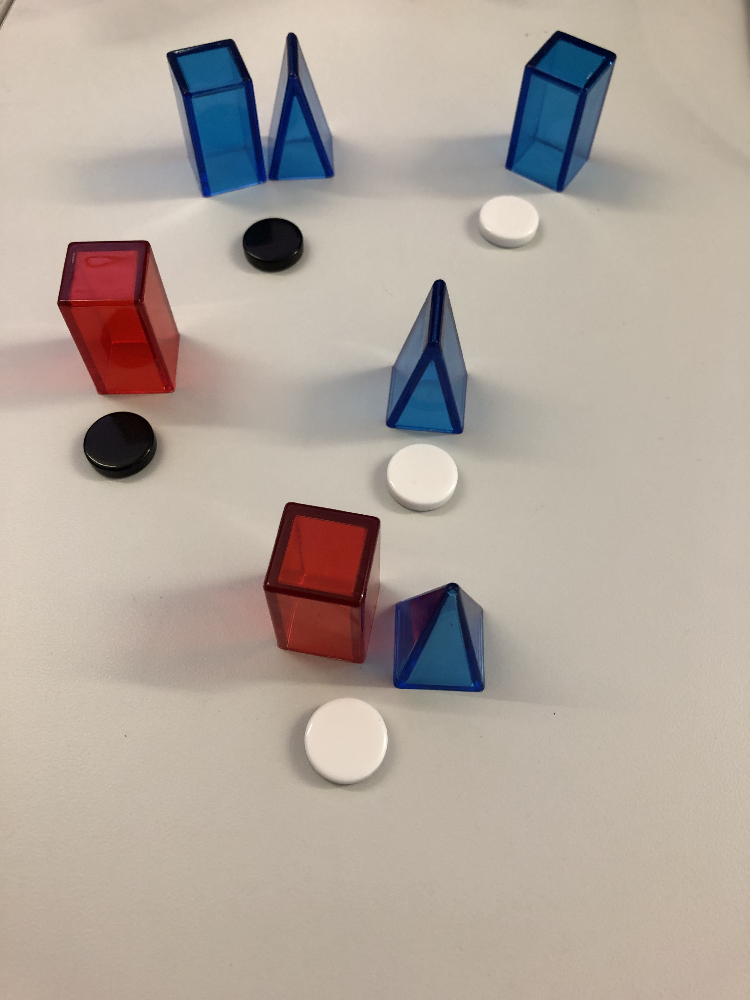

# Guess the rule (optional)

The second "student" now spends their guessing cube, and states that the rule is "exactly one blue piece".

They are correct! The "master" reveals the rule and the game is over:

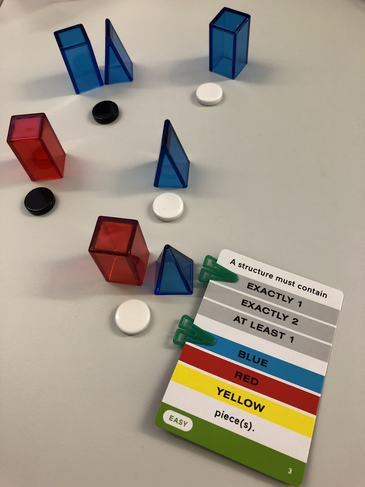
